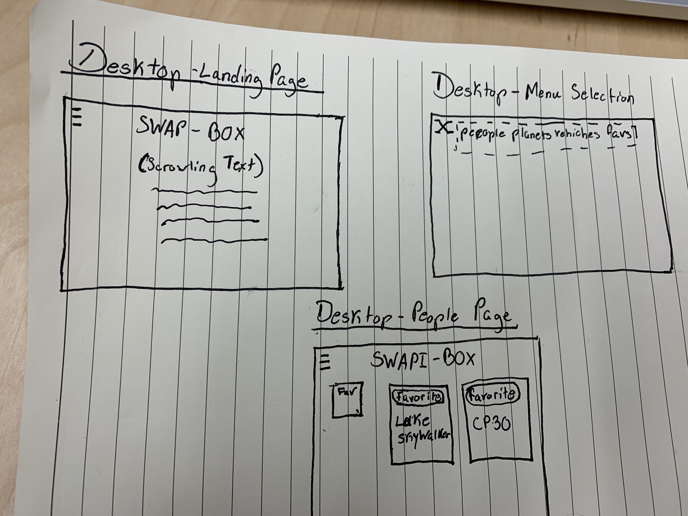

# SWAPI-BOX

For this project my group was given the challenge of using [The Star Wars API](https://swapi.co/documentation) to create an single application using React.js and React Router. 
Our application allows users to navigate through the different tabs that generate cards that display Star Wars characters, their home planets, and vehicles used in the films. On each card their is a favorites button that our user can select to then veiw later via the Favorites button in the menu. 

#### Demo:

### Installation Instructions:

Open Your Terminal

Copy and paste the following lines below into your terminal:

`git clone https://github.com/mike-duke/SWAPI-box.git`

`cd SWAPI-box/`

`npm install`

`npm start`

### WireFrames

